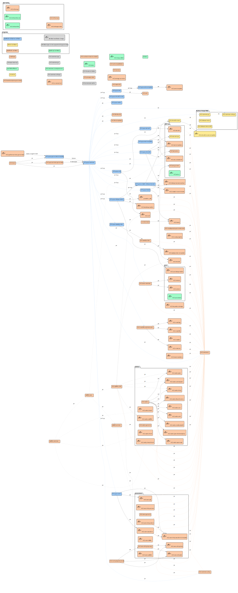

# th2-dependencies

This repository conains script, which analyses dependencies of repositories in [th2-net](https://github.com/th2-net) and creates dependencies diagram with [PlantUML](https://plantuml.com/en/) tool.

## Relevant schema

The output in this folder is updated every 24 hours. Last version is available [here](https://raw.githubusercontent.com/d0rich/th2-dependencies/master/output/schema.svg).


## Requirements

1. [Node.js](https://nodejs.org/en/) installed 
2. [Graphviz](http://www.graphviz.org/) installed (dependency of PlantUML)

## Run script

1. Clone repository
    ```sh
    git clone https://github.com/d0rich/th2-dependencies
    ```

2. Go to repository's folder
    ```sh
    cd th2-dependencies
    ```

3. Create `.env` file with [GitHub Personal Access Token](https://docs.github.com/en/authentication/keeping-your-account-and-data-secure/creating-a-personal-access-token) (required for GitHub REST API authorization, only access to public repositories needed)
    ```dotenv
    GH_TOKEN=<your-pat>
    ```
4. Install dependencies:
    ```sh
    npm install
    ```
5. Run the script:
   ```sh
   npm run generate
   ```
